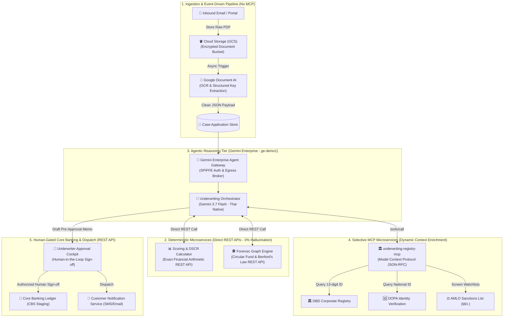
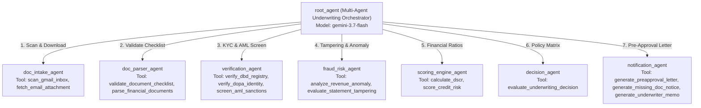

# 🏛️ Technical Architecture Blueprint: Autonomous SME Underwriting Platform

> **System Name**: Gemini Enterprise Autonomous SME Underwriting Platform (v2)  
> **Author**: Google Cloud Customer Engineering  
> **Core Engine**: Gemini Enterprise Engine `ge-demo1` (`default_collection`)  
> **Reasoning Model**: Gemini 3.7 Flash (`gemini-3.7-flash`)  
> **Protocol**: Model Context Protocol (MCP) JSON-RPC over HTTPS  
> **Compute Platform**: Google Cloud Run (Serverless Microservices)

---

## 1. Executive Summary & Business Context

Traditional SME loan underwriting in commercial banks requires **5 to 7 business days** and incurs high operational costs (averaging **4,500 THB per case**) due to fragmented document verification, manual credit bureau lookups, AML sanctions screening, debt service coverage ratio (DSCR) calculations, and risk committee memo drafting.

This solution deploys an **Autonomous Multi-Agent Underwriting System** powered by **Gemini 3.7 Flash** in **Gemini Enterprise (Agent Designer v2)**, coupled with **7 Decoupled Microservices** hosted on **Google Cloud Run** exposed via the **Model Context Protocol (MCP)** standard.

```
┌─────────────────────────────────────────────────────────────────────────────┐
│                             BUSINESS IMPACT                                 │
├───────────────────────────────┬───────────────────────────────┬─────────────┤
│ Metric                        │ Traditional Underwriting      │ Gemini AI   │
├───────────────────────────────┼───────────────────────────────┼─────────────┤
│ Turnaround Time (TAT)         │ 5 - 7 Business Days           │ < 60 Secs   │
│ Processing Cost per Case      │ ~4,500 THB                    │ < 15 THB    │
│ Financial Statement Tampering │ Manual Sampling (~10%)        │ 100% Audit  │
│ Language & Customer Outreach  │ Manual Letter Generation      │ Auto (Thai) │
└───────────────────────────────┴───────────────────────────────┴─────────────┘
```

---

## 2. High-Level Architecture Topology (Pragmatic Hybrid Model)

Rather than forcing every component into MCP, the enterprise architecture follows a **Pragmatic Hybrid Pattern**:
* **Event-Driven & Storage Pipelines** for heavy binary files and raw OCR (avoiding context window bloat).
* **Deterministic High-Speed REST APIs** for exact financial calculations (avoiding LLM math hallucinations).
* **Model Context Protocol (MCP)** strictly for **Dynamic Context Enrichment** (Government registries & AML screening where LLM reasoning is required).
* **Direct REST APIs with Human Gating** for core banking staging and notification dispatch.



---

## 3. Multi-Agent Orchestration Hierarchy

The agent hierarchy in Gemini Enterprise is structured into **8 nodes**:



---

## 4. MCP Microservices Catalog (7 Cloud Run Services)

Every microservice implements JSON-RPC 2.0 compliance with `tools/list` and `tools/call`.

### 1. `underwriting-gmail-mcp`
* **Endpoint**: `https://underwriting-gmail-mcp-<REGION_HASH>.a.run.app/mcp`
* **Purpose**: Omnichannel intake, inbox scanning for loan applications, attachment fetching.
* **Tools**:
  * `scan_gmail_inbox(query, max_results)`: Scans mailbox for tagged application submissions.
  * `fetch_email_attachment(message_id, attachment_id)`: Fetches bank statements and legal files.

### 2. `underwriting-doc-mcp`
* **Endpoint**: `https://underwriting-doc-mcp-<REGION_HASH>.a.run.app/mcp`
* **Purpose**: Document intake verification and OCR parsing of financial statements.
* **Tools**:
  * `validate_document_checklist(applicant_id, submitted_documents)`: Evaluates mandatory compliance checklist.
  * `parse_financial_documents(document_type, document_data)`: Extracts balance sheets, P&L, and cashflow.

### 3. `underwriting-registry-mcp`
* **Endpoint**: `https://underwriting-registry-mcp-<REGION_HASH>.a.run.app/mcp`
* **Purpose**: Regulatory validation with Thai government systems.
* **Tools**:
  * `verify_dbd_registry(juristic_id, company_name)`: Validates active corporate standing with DBD.
  * `verify_dopa_identity(national_id, first_name, last_name)`: Checks authorized directors with DOPA.
  * `screen_aml_sanctions(entity_name, entity_type)`: Screens against AMLO and PEP lists.

### 4. `underwriting-fraud-mcp`
* **Endpoint**: `https://underwriting-fraud-mcp-<REGION_HASH>.a.run.app/mcp`
* **Purpose**: Forensic audit and financial tampering detection.
* **Tools**:
  * `analyze_revenue_anomaly(monthly_revenues, industry_type)`: Detects statistical revenue spikes.
  * `evaluate_statement_tampering(statement_id, reported_balance)`: Verifies running balance arithmetic.

### 5. `underwriting-scoring-mcp`
* **Endpoint**: `https://underwriting-scoring-mcp-<REGION_HASH>.a.run.app/mcp`
* **Purpose**: Quantitative debt service coverage and credit grading.
* **Tools**:
  * `calculate_dscr(net_operating_income, total_debt_service)`: Computes Debt Service Coverage Ratio.
  * `score_credit_risk(applicant_type, dscr, years_in_business, ncb_grade)`: Yields A/B/C/D credit rating.

### 6. `underwriting-decision-mcp`
* **Endpoint**: `https://underwriting-decision-mcp-<REGION_HASH>.a.run.app/mcp`
* **Purpose**: Commercial credit policy rule engine.
* **Tools**:
  * `evaluate_underwriting_decision(applicant_id, requested_amount, credit_score, dscr, fraud_risk, dbd_verified, aml_cleared)`: Fast-track approval matrix evaluation.

### 7. `underwriting-notification-mcp`
* **Endpoint**: `https://underwriting-notification-mcp-<REGION_HASH>.a.run.app/mcp`
* **Purpose**: Automated multi-channel communication and executive memorandum generation.
* **Tools**:
  * `generate_preapproval_letter(applicant_id, company_name, approved_amount, interest_rate, tenor_months)`: Generates formal pre-approval letters in Thai.
  * `generate_missing_doc_notice(applicant_id, missing_docs)`: Issues missing document requests with secure upload links.
  * `generate_underwriter_memo(applicant_id, decision, rationale)`: Produces Credit Committee Referral Memos.

---

## 5. Enterprise Security & Governance

1. **Organization Policy Enforcement**:
   * Custom MCP server connectivity is governed via `constraints/discoveryengine.managed.disableCustomMcpServerConnector` (`enforce: false`).
2. **Egress Control & Domain Whitelisting**:
   * Outbound communication from Gemini Enterprise is restricted exclusively to authorized Cloud Run domains (`*.run.app`).
3. **Identity & Authorization**:
   * Agents operate with SPIFFE ID identities (`spiffeIdType: USER`) within `discoveryengine.googleapis.com`.
4. **Data Isolation**:
   * All microservices are stateless; banking payloads are processed in-memory without persistent retention on untrusted nodes.

---

## 6. Architectural Decision Matrix: When to Use MCP vs. Direct REST / Storage

To prevent the **"Golden Hammer" anti-pattern** (forcing every workload into MCP), the platform applies strict architectural boundaries:

| Workload / Capability | Recommended Pattern | Why NOT MCP? |
| :--- | :---: | :--- |
| **Raw File Ingestion (PDF, Scans, Statement CSVs)** | **Cloud Storage (GCS) + Document AI** | ❌ **Context Bloat:** Streaming binary base64 or 50MB PDFs into LLM context window wastes tokens, spikes latency, and risks context truncation. Store in GCS and pass only clean JSON summaries to the agent. |
| **Exact Financial Math (DSCR, D/E, Loan Installments)** | **Deterministic REST API (Python/Go)** | ❌ **Arithmetic Hallucination:** LLMs should never calculate mission-critical compound interest or ratio formulas. Use deterministic microservices returning exact floats. |
| **Government & External Registries (DBD, DOPA, AMLO)** | **Model Context Protocol (MCP)** | 🟢 **MCP Sweet Spot:** Dynamic context enrichment with small input/output payloads where the Agent needs to reason on the result and dynamically choose subsequent actions. |
| **Complex Graph & Forensic Fraud Scoring** | **BigQuery / Python REST API** | ❌ **Computationally Heavy:** Graph traversal for circular money laundering across 10,000 transactions belongs in BigQuery/Pandas, returning a simple fraud score `{fraud_score: 12}`. |
| **Core Banking Ledger Write (CBS Account Debit/Disbursal)** | **Human-in-the-Loop + REST API** | ❌ **Catastrophic Risk:** Never allow unconstrained autonomous agent writes to financial ledgers. Agent drafts the order; authorized human signs off to trigger the Core Banking REST API. |
| **Official Thai Memo & Letter Drafting** | **Gemini 3.7 Flash Reasoning** | 🟢 **LLM Sweet Spot:** High-empathy, context-aware natural language drafting strictly governed by bank tone and policy templates. |

