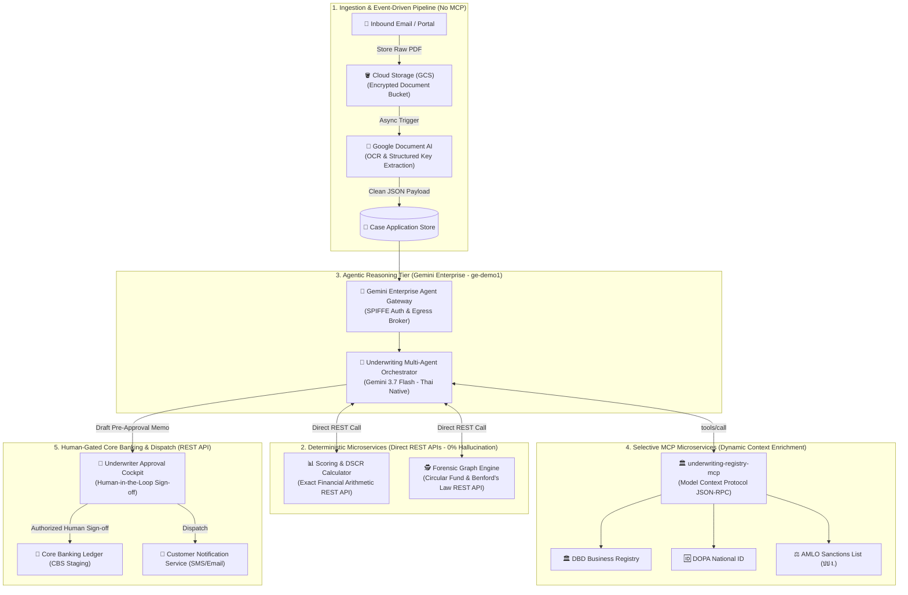

# 🏦 Autonomous SME Loan Underwriting Platform
### *Powered by Gemini Enterprise (Agent Designer v2), Gemini 3.7 Flash & 7 Cloud Run MCP Microservices*

<p align="center">
  
  
  
  
  
</p>

---

## 🌐 How to View the Interactive Presentation & Simulator

You have **3 convenient ways** to view and interact with the executive presentation and live underwriting flow simulator:

| Viewing Mode | How to Access | Best For |
| :--- | :--- | :--- |
| 🚀 **Option 1: Live Web (GitHub Pages)** | [**Launch Live Web App**](https://pheeraphongaj.github.io/gemini-enterprise-mcp-underwriting/) *(if repo is Public & Pages enabled)* | Live sharing with clients without downloading files |
| 💻 **Option 2: 1-Click Local Browser** | Double-click **`index.html`** or **`underwriting_solution_presentation.html`** in any browser (Chrome/Edge/Safari) | Offline presentations, internal demo sessions |
| 📄 **Option 3: Direct in GitHub README** | Scroll down to the [**Interactive Demo Scenarios**](#-interactive-demo-scenarios--generated-memos) section below | Instant preview directly inside GitHub UI |

```
┌──────────────────────────────────────────────────────────────────────────────────┐
│  🖥️ INTERACTIVE SIMULATOR PREVIEW (index.html)                                  │
├──────────────────────────────────────────────────────────────────────────────────┤
│  [🎯 Select Scenario]               [🔄 Agent Execution Pipeline]                │
│  ◉ 1. Siam Software (Fast-Track)    ✓ 1. Gmail Scanner & Doc Intake (200 OK)     │
│  ○ 2. Bangkok Logistics (Missing)   ✓ 2. DBD & AML Compliance Check (200 OK)     │
│  ○ 3. Thai Trading (Tampered Stmt)  ✓ 3. Fraud & Anomaly Detection  (200 OK)     │
│  ○ 4. Global Invest (AML Sanction)  ✓ 4. DSCR & Credit Scoring      (200 OK)     │
│                                     ✓ 5. Underwriting Decision Memo (200 OK)     │
│  [⚡ Run Autonomous Evaluation]                                                  │
│                                     [📑 Generated Pre-Approval Memo (Thai)]      │
│                                     🟢 FAST-TRACK PRE-APPROVED                   │
│                                     • Facility: 10,000,000 THB @ 5.75% (60 Mos)  │
│                                     • DSCR: 1.73 (Benchmark ≥ 1.25)              │
└──────────────────────────────────────────────────────────────────────────────────┘
```

---

## 📊 Executive Overview & Business Value

Traditional SME commercial loan underwriting takes **5 to 7 business days** and costs banks **~4,500 THB per application** due to manual KYC/AML lookups, forensic document audits, and committee memo drafting.

This solution transforms the entire loan origination lifecycle into an **autonomous multi-agent system** that completes end-to-end evaluation in **under 60 seconds** for **less than 15 THB**.

| Key Performance Indicator | Traditional Underwriting | Autonomous Gemini Multi-Agent | Impact |
| :--- | :---: | :---: | :---: |
| ⏱️ **Turnaround Time (TAT)** | 5 – 7 Business Days | **< 60 Seconds** | ⚡ **99% Faster** |
| 💰 **Underwriting Cost per Case** | ~4,500 THB | **< 15 THB** | 📉 **95% Reduction** |
| 🛡️ **Forensic Statement Tampering Audit** | Manual Sampling (~10%) | **100% Automated Audit** | 🔍 **Zero Blindspots** |
| 📑 **Executive & Customer Documentation** | Manual drafting in Word | **Instant Auto-Generation (Thai)** | ⏱️ **Zero Latency** |

---

## 🏛️ System Architecture Topology (Pragmatic Hybrid Model)

The enterprise architecture avoids forcing every component into MCP, applying a **Pragmatic Hybrid Pattern**:
* **Event-Driven & Storage Pipelines** for raw file ingestion and Document AI (zero token context bloat).
* **Deterministic High-Speed REST APIs** for mathematical formulas (exact DSCR, zero calculation hallucination).
* **Selective MCP Microservices** strictly for **Dynamic Context Enrichment** (DBD, DOPA, AMLO registries).
* **Human-Gated REST APIs** for Core Banking System (CBS) transaction staging.



---

## 🧩 7 Cloud Run MCP Microservices & 15 Tools

All microservices adhere strictly to the **Model Context Protocol (JSON-RPC 2.0)** over HTTPS.

<table>
  <thead>
    <tr>
      <th width="30%">MCP Microservice</th>
      <th width="30%">Exposed Tools</th>
      <th width="40%">Core Functionality</th>
    </tr>
  </thead>
  <tbody>
    <tr>
      <td><b>1. <code>underwriting-gmail-mcp</code></b></td>
      <td>
        • <code>scan_gmail_inbox</code><br>
        • <code>fetch_email_attachment</code>
      </td>
      <td>Omnichannel email intake, inbox monitoring for loan submissions, and attachment ingestion.</td>
    </tr>
    <tr>
      <td><b>2. <code>underwriting-doc-mcp</code></b></td>
      <td>
        • <code>validate_document_checklist</code><br>
        • <code>parse_financial_documents</code>
      </td>
      <td>Mandatory checklist compliance validation, OCR parsing of bank statements & P&L statements.</td>
    </tr>
    <tr>
      <td><b>3. <code>underwriting-registry-mcp</code></b></td>
      <td>
        • <code>verify_dbd_registry</code><br>
        • <code>verify_dopa_identity</code><br>
        • <code>screen_aml_sanctions</code>
      </td>
      <td>Department of Business Development (DBD) corporate lookup, DOPA ID verification, and AMLO sanctions screening.</td>
    </tr>
    <tr>
      <td><b>4. <code>underwriting-fraud-mcp</code></b></td>
      <td>
        • <code>analyze_revenue_anomaly</code><br>
        • <code>evaluate_statement_tampering</code>
      </td>
      <td>Detects statistical revenue spikes, circular transactions, and running daily balance arithmetic tampering.</td>
    </tr>
    <tr>
      <td><b>5. <code>underwriting-scoring-mcp</code></b></td>
      <td>
        • <code>calculate_dscr</code><br>
        • <code>score_credit_risk</code>
      </td>
      <td>Computes Debt Service Coverage Ratio (DSCR) and assigns credit rating (Grade A/B/C/D).</td>
    </tr>
    <tr>
      <td><b>6. <code>underwriting-decision-mcp</code></b></td>
      <td>
        • <code>evaluate_underwriting_decision</code>
      </td>
      <td>Applies bank credit policy matrix for fast-track pre-approvals, facility limits, and interest rate pricing.</td>
    </tr>
    <tr>
      <td><b>7. <code>underwriting-notification-mcp</code></b></td>
      <td>
        • <code>generate_preapproval_letter</code><br>
        • <code>generate_missing_doc_notice</code><br>
        • <code>generate_underwriter_memo</code>
      </td>
      <td>Generates professional, regulatory-compliant pre-approval letters, missing doc notices, and Credit Committee Memos in Thai.</td>
    </tr>
  </tbody>
</table>

---

## 🎯 Interactive Demo Scenarios & Generated Memos

<details open>
<summary><b>🟢 Scenario 1: Clean Fast-Track SME Approval (บริษัท สยาม ซอฟต์แวร์ โซลูชั่น จำกัด)</b></summary>
<br>

**Applicant Profile**:
* **Company**: บริษัท สยาม ซอฟต์แวร์ โซลูชั่น จำกัด (DBD: `0105558000001`)
* **Requested Facility**: 10,000,000 THB (Working Capital)
* **DSCR**: 1.73 | **Credit Rating**: Grade A | **AML**: Clear

**Agent Generated Approval Memorandum (Thai)**:
```markdown
# 🏦 COMMERCIAL CREDIT APPROVAL MEMORANDUM
เลขที่ใบคำขอ: APP-2026-001
วันที่พิจารณา: 25 สิงหาคม 2026
ผู้ขอสินเชื่อ: บริษัท สยาม ซอฟต์แวร์ โซลูชั่น จำกัด (ทะเบียนนิติบุคคล 0105558000001)

━━━━━━━━━━━━━━━━━━━━━━━━━━━━━━━━━━━━━━━━━━━━━━━━━
1. ผลการพิจารณา (Underwriting Decision): 
   🟢 อนุมัติเบื้องต้นแบบ Fast-Track (PRE-APPROVED)
   • วงเงินสินเชื่อที่อนุมัติ: 10,000,000 บาท (สินเชื่อหมุนเวียนเสริมสภาพคล่องธุรกิจ)
   • อัตราดอกเบี้ย: MRR - 1.25% (เทียบเท่า 5.75% ต่อปี)
   • ระยะเวลาผ่อนชำระ: 60 เดือน

2. การตรวจสอบเอกสารและความถูกต้อง (Verification & KYC/AML):
   ✓ ตรวจสอบสถานะนิติบุคคล DBD: ดำเนินการ 5 ปี ทุนจดทะเบียน 5,000,000 บาท (สถานะ: ปกติ)
   ✓ ตรวจสอบรายชื่อบุคคลต้องห้าม (AML/CFT Sanctions): ผ่านการคัดกรอง 100% ไม่ติดประวัติ
   ✓ เอกสารประกอบการยื่นกู้: ครบถ้วนตามมาตรฐาน Checklist

3. สรุปการวิเคราะห์ทางการเงิน (Financial & Risk Analysis):
   • รายได้เฉลี่ยต่อเดือน: 1,243,333 บาท
   • ความสามารถในการชำระหนี้ (DSCR): 1.73 เท่า (เกณฑ์ขั้นต่ำธนาคาร ≥ 1.25 เท่า)
   • ความเสี่ยงด้านการทุจริตสเตทเมนต์: ต่ำมาก (Low Risk - ไม่พบการดัดแปลงยอดเงิน)
   • อันดับเครดิตธุรกิจ (Credit Rating): Grade A (ความเสี่ยงต่ำมาก)

4. เอกสารที่จัดทำและส่งออกอัตโนมัติ:
   ✓ สร้างจดหมายแจ้งผลการอนุมัติเบื้องต้น (Pre-Approval Letter) ส่งผ่านอีเมลเรียบร้อยแล้ว
```
</details>

<details>
<summary><b>🟡 Scenario 2: Incomplete Application / Missing Audited Financials (บริษัท บางกอก โลจิสติกส์)</b></summary>
<br>

**Applicant Profile**:
* **Company**: บริษัท บางกอก โลจิสติกส์ เซอร์วิสเซส จำกัด (DBD: `0105558000002`)
* **Requested Facility**: 5,000,000 THB
* **Status**: Missing 2025 CPA Audited Financial Statement & Shareholder List (บอจ.5)

**Agent Generated Missing Document Notice (Thai)**:
```markdown
# 📑 NOTIFICATION: PENDING MISSING DOCUMENTS
เลขที่ใบคำขอ: APP-2026-002
ผู้ขอสินเชื่อ: บริษัท บางกอก โลจิสติกส์ เซอร์วิสเซส จำกัด (0105558000002)

━━━━━━━━━━━━━━━━━━━━━━━━━━━━━━━━━━━━━━━━━━━━━━━━━
1. ผลการตรวจเอกสารรับเข้า (Document Intake Status):
   ⚠️ ขาดเอกสารสำคัญประกอบการพิจารณา (Missing Required Documents)

2. รายการเอกสารที่ต้องนำส่งเพิ่มเติม:
   [ ] งบการเงินที่ผ่านการตรวจสอบโดยผู้สอบบัญชีรับอนุญาต (CPA) ประจำปี 2568
   [ ] สำเนาบัญชีรายชื่อผู้ถือหุ้น (บอจ.5) ฉบับปรับปรุงไม่เกิน 3 เดือน

3. การดำเนินการของระบบ:
   ✓ สร้างและส่งหนังสือแจ้งขอเอกสารเพิ่มเติม (Missing Document Notice) ผ่านระบบอีเมล
   ✓ สร้าง Secure Upload Link พร้อมรหัส OTP ให้ลูกค้าส่งเอกสารต่อได้ทันที
```
</details>

<details>
<summary><b>🔴 Scenario 3: Bank Statement Tampering Detection (บริษัท ไทย เทรดดิ้ง พาร์ทเนอร์ จำกัด)</b></summary>
<br>

**Applicant Profile**:
* **Company**: บริษัท ไทย เทรดดิ้ง พาร์ทเนอร์ จำกัด (DBD: `0105558000003`)
* **Requested Facility**: 15,000,000 THB
* **Status**: Forensic audit detects arithmetic balance discrepancy and forged inflows.

**Agent Generated Fraud Alert & Decline Memorandum (Thai)**:
```markdown
# 🚨 FRAUD RISK ALERT & DECLINE MEMORANDUM
เลขที่ใบคำขอ: APP-2026-003
ผู้ขอสินเชื่อ: บริษัท ไทย เทรดดิ้ง พาร์ทเนอร์ จำกัด (0105558000003)

━━━━━━━━━━━━━━━━━━━━━━━━━━━━━━━━━━━━━━━━━━━━━━━━━
1. ผลการพิจารณา (Underwriting Decision): 
   🚫 ปฏิเสธการให้สินเชื่อ (REJECTED) - ตรวจพบความเสี่ยงทุจริตระดับสูง

2. ข้อตรวจพบด้านการดัดแปลงเอกสาร (Fraud Detection Findings):
   • เครื่องมือ analyze_revenue_anomaly & evaluate_statement_tampering ตรวจพบความผิดปกติ
   • ยอดเงินคงเหลือสะสมในสเตทเมนต์ (Bank Statement) ไม่ตรงกับผลรวมกระแสเงินสดจริง
   • มีการแก้ไขเลขอักษรยอดเงินเข้าเดือนมีนาคม-พฤษภาคม เพื่อสร้างตัวเลขเทียม
   • บันทึกส่งต่อฝ่ายตรวจสอบทุจริต (Internal Audit / Fraud Unit) เพื่อเฝ้าระวัง
```
</details>

<details>
<summary><b>⛔ Scenario 4: AML / Sanctions Hard Block (บริษัท โกลบอล อินเวสท์เมนท์ กรุ๊ป จำกัด)</b></summary>
<br>

**Applicant Profile**:
* **Company**: บริษัท โกลบอล อินเวสท์เมนท์ กรุ๊ป จำกัด (DBD: `0105558000004`)
* **Requested Facility**: 25,000,000 THB
* **Status**: Authorized Director matches AMLO Designated Persons List.

**Agent Generated Compliance Block Memorandum (Thai)**:
```markdown
# ⛔ COMPLIANCE BLOCK MEMORANDUM
เลขที่ใบคำขอ: APP-2026-004
ผู้ขอสินเชื่อ: บริษัท โกลบอล อินเวสท์เมนท์ กรุ๊ป จำกัด (0105558000004)

━━━━━━━━━━━━━━━━━━━━━━━━━━━━━━━━━━━━━━━━━━━━━━━━━
1. ผลการพิจารณา (Underwriting Decision): 
   ⛔ ระงับการทำธุรกรรมทันที (COMPLIANCE HARD BLOCK)

2. ผลการคัดกรองรายชื่อบุคคลต้องห้าม (AML / PEP Screening):
   • เครื่องมือ screen_aml_sanctions ตรวจพบกรรมการผู้มีอำนาจติดรายชื่อเฝ้าระวัง
   • รายชื่อตรงกับฐานข้อมูล Designated Persons List ของสำนักงาน ปปง.
   • ปิดกั้นกระบวนการสินเชื่อตามข้อกำหนดกฎหมายฟอกเงิน พ.ร.บ. ป้องกันและปราบปรามการฟอกเงิน
```
</details>

---

## ⚡ Fast-Track 3-Step Deployment

Clone and deploy the entire solution to any target Google Cloud project in **~10 minutes**:

```bash
# 1. Clone this repository
git clone https://github.com/pheeraphongaj/gemini-enterprise-mcp-underwriting.git
cd gemini-enterprise-mcp-underwriting

# 2. Run the unified automated deployment script
python3 deploy_all.py --project-id YOUR_PROJECT_ID --region asia-southeast1 --engine-id ge-demo1

# 3. Verify all 15 MCP tools across 7 microservices
python3 test_all_mcp_servers.py
```

---

## 📚 Technical Documentation Index

* 🏛️ **[Technical Architecture Blueprint](ARCHITECTURE.md)**: Deep dive into multi-agent hierarchy, sequence flows, and security.
* 🚀 **[Step-by-Step Setup Guide](SETUP_GUIDE.md)**: Complete deployment playbook from IAM to Agent Designer v2.
* 💬 **[Sample Demo Prompts](SAMPLE_PROMPTS.md)**: Ready-to-copy customer demo prompts in Thai and English.
* 🧪 **[Interactive Presentation & Simulator](underwriting_solution_presentation.html)**: Standalone executive HTML slide deck.


